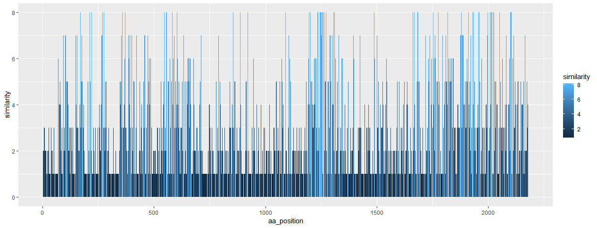

# seq_count
Count similar amino acids among multiple amino acid sequences

This R script allows to count the number of letters at a particular position in multiple sequences. 

##Practical Usage
I have seven strains of viruses. Virus "a" is my reference strain. I want to know how the amino acid sequences are conserved among all the seven strains of viruses. For this, first I have to align the amino acid sequences of all the viruses. Then this script can be used to cound the number of similar amino acids. For example, if my virus "a" has "M" at the position 1 and all other six viruses too have "M" at first position. Then the similarity score would be 7. So, this is highly conserved amino acid. In this way it will scan all the positions. 

This script can omit puntuation marks that appear in alignement files. So, the results are more clear. 

You can add more variables by yourself if you need more than 8 sequences.

Here is the example output for my Senecavirus. Remember this script considers variable "a" as reference. 

